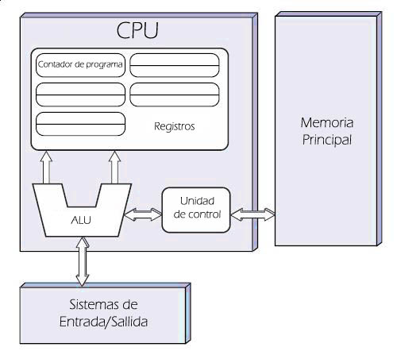

# Noção geral da arquitetura

Antes de ver a linguagem Assembly em si é importante ter conhecimento sobre a arquitetura do Assembly que vamos estudar, até porque estão intrinsecamente ligados.  
É claro que não dá para explicar todas as características da arquitetura x86 aqui, só para ter uma noção o manual para desenvolvedores da Intel tem mais de 4.900 páginas. \(um dia eu vou ler tudo... Um dia\)  
Mas por enquanto vamos ter uma noção geral da arquitetura x86.

### O que é a arquitetura x86?

Esta arquitetura nasceu no 8086, que foi um microprocessador da Intel que fez grande sucesso.  
Daí em diante a Intel lançou outros processadores baseados na arquitetura do 8086 ganhando nomes como: 80186, 80286, 80386 etc.  
Daí surgiu a nomenclatura x86, já que o nome dos processadores era um número qualquer \(x\) terminando com 86.

A arquitetura evoluiu com o tempo e foi ganhando adições de tecnologias, porém sempre mantendo compatibilidade com os processadores anteriores.  
O processador que você tem aí pode rodar código programado para o 8086 sem problema algum.

Mais para frente a AMD criou a arquitetura x86-64, que é um superconjunto da arquitetura x86 da Intel e adiciona o modo de 64 bit.  
Nos dias atuais a Intel e a AMD fazem um trabalho em conjunto para a evolução da arquitetura, por isso os processadores das duas fabricantes são compatíveis.

Ou seja, x86 é um nome genérico para se referir a uma família de arquiteturas de processadores.  
Por motivos de simplicidade eu vou me referir as arquiteturas apenas como x86, mas na prática estamos abordando três arquiteturas neste livro:

| Nome oficial | Nome alternativo | Bit |
| :--- | :--- | :--- |
|  | IA-16 | 16 |
| IA-32 | i386 | 32 |
| x86-64 | i686 | 64 |

AMD64 e Intel64 são os nomes das implementações da AMD e da Intel para a arquitetura x86-64. Podemos dizer aqui que são sinônimos já que as implementações são compatíveis.

Um software compilado para x86 consegue tanto rodar em um processador Intel como também AMD. Só fazendo diferença é claro em detalhes de otimização que são específicos para determinados processadores.  
Bem como também algumas tecnologias exclusivas de cada uma das fabricantes.


Comumente um compilador não irá gerar código usando tecnologia exclusiva, afim de aumentar a portabilidade.  
Alguns compiladores aceitam que você passe uma _flag_ na linha de comando para que eles otimizem o código usando tecnologias exclusivas, [como o GCC](https://gcc.gnu.org/onlinedocs/gcc/x86-Options.html) por exemplo.


### Endianness

A arquitetura x86 é little-endian, o que significa que a ordem dos bytes de valores numéricos segue do menos significativo ao mais significativo.  
Por exemplo, o seguinte valor numérico em hexadecimal `0x1a2b3c4d` ficaria disposto na memória RAM na seguinte ordem:

```text
4d 3c 2b 1a
```

### Instruções

A arquitetura x86 é uma arquitetura [CISC](https://pt.wikipedia.org/wiki/CISC) que, resumindo, é uma arquitetura com um conjunto complexo de instruções.  
Falando de maneira leviana isso significa que há várias instruções e cada uma delas tem um nível de complexidade completamente variada. Boa parte das instruções são complexas na arquitetura x86. Uma instrução "complexa" é uma instrução que faz várias operações.

Cada instrução do código de máquina tem um tamanho que pode variar de 1 até 15 bytes. E cada instrução consome um número de ciclos diferente. \(devido a sua complexidade variada\)

### Modelo

A arquitetura x86 segue o modelo de [Von Neumann](https://pt.wikipedia.org/wiki/Arquitetura_de_von_Neumann) onde este, mais uma vez resumindo, trabalha principalmente usando uma unidade central de processamento \(CPU\) e uma memória principal.



As instruções podem trabalhar manipulando/lendo dados em registradores, que são pequenas áreas de memória internas a CPU, e na memória principal que no caso é a memória RAM.  
Bem como também usar o sistema de entrada e saída de dados, feito pelas portas físicas.

### Portas físicas

Uma porta física é um _socket_ do processador usado para se comunicar com o restante do _hardware_. Por exemplo para poder usar a memória secundária, o [HD](https://pt.wikipedia.org/wiki/Unidade_de_disco_r%C3%ADgido), usamos uma porta física para enviar e receber dados do dispositivo.  
O gerenciamento desta comunicação é feito pelo _chipset_ da placa-mãe.

Do nosso ponto de vista uma porta física é só um número especificado na instrução, muito parecido com uma porta lógica usada para comunicação em rede.

### FPU

Na época do 8086 a Intel também lançou o chamado 8087, que é um co-processador de ponto flutuante que trabalhava em conjunto com o 8086.  
Os processadores seguintes também ganharam co-processadores que receberam o nome genérico de x87.  
A partir do 80486 a FPU é interna a CPU e não mais um co-processador, porém por motivos históricos ainda chamamos a unidade de ponto flutuante da arquitetura x86 de x87.

FPU nada mais é que a unidade de processamento responsável por fazer cálculos de ponto flutuante, os famosos números _float_.

### Outras tecnologias

Quem dera um processador fosse tão simples assim, já mencionei que o manual da Intel tem mais de 4.900 páginas?  
Deixei de abordar muita coisa aqui mas que fique claro que os processadores da arquitetura x86 tem várias outras tecnologias, como o 3DNow! da AMD e o SSE da Intel.


Os processadores da AMD também implementam o SSE, já o 3DNow! é exclusivo dos processadores da AMD.


