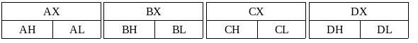

# Registradores de propósito geral

Seguindo o modelo da arquitetura de Von Neumann, interno a CPU existem pequenos espaços de memória chamados de _registers_, ou em português, registradores.

Esses espaços de memória são pequenos, apenas o suficiente para armazenar um valor numérico de N bits de tamanho. Ler e escrever dados em um registrador é muito mais rápido do que a tarefa equivalente na memória principal. Do ponto de vista do programador é interessante usar registradores para manipular valores enquanto está trabalhando com eles, e depois armazená-lo de volta na memória se for o caso. Seguindo um fluxo como:

```
Registrador = Memória
Operações com o valor no registrador
Memória = Registrador
```

### Mapeamento dos registradores

Afim de aumentar a versatilidade no uso de registradores, para poder manipular dados de tamanhos variados no mesmo espaço de memória do registrador, alguns registradores são subdivido em registradores menores. Isso seria o "mapeamento" dos registradores que faz com que vários registradores de tamanhos diferentes compartilhem o mesmo espaço. Se você entende como funciona uma `union` em C já deve ter entendido a lógica aqui.

Lá nos primórdios da arquitetura x86 os registradores tinham o tamanho de 16 bits (2 bytes). Os processadores IA-32 aumentaram o tamanho desses registradores para acompanhar a largura do barramento interno de 32 bits (4 bytes). A referência para o registrador completo ganhou um prefixo 'E' que seria a primeira letra de "Extended" (estendido). Processadores x86-64 aumentaram mais uma vez o tamanho desses registradores para 64 bits (8 bytes), dessa vez dando um prefixo 'R' que seria de "Re-extended" (re-estendido). Só que também trazendo alguns novos registradores de propósito geral.

### Registradores de propósito geral (IA-16)

Os registradores de propósito geral (**GPR** na sigla em inglês) são registradores que são, como o nome sugere, de uso geral pelas instruções. Na arquitetura IA-16 nós temos os registradores de 16 bits que são mapeados em subdivisões como explicado acima.

Determinadas instruções da arquitetura usam alguns desses registradores para tarefas específicas mas eles não são limitados somente para esse uso. Você pode usá-los da maneira que quiser porém recomendo seguir o padrão para melhorar a legibilidade do código. O "apelido" na tabela abaixo é o nome dado aos registradores em inglês, serve para fins de memorização.

| Registrador | Apelido           | Uso                                                                                                                                             |
| ----------- | ----------------- | ----------------------------------------------------------------------------------------------------------------------------------------------- |
| AX          | Accumulator       | Usado em instruções de operações aritméticas para receber o resultado de um cálculo.                                                            |
| BX          | Base              | Usado geralmente em endereçamento de memória para se referir ao endereço inicial, isto é, o endereço base.                                      |
| CX          | Counter           | Usado em instruções de repetição de código (_loops_) para controlar o número de repetições.                                                     |
| DX          | Data              | Usado em operações de entrada e saída por portas físicas para armazenar o dado enviado/recebido.                                                |
| SP          | Stack Pointer     | Usado como ponteiro para o topo da [_stack_](pilha.md).                                                                                         |
| BP          | Base Pointer      | Usado como ponteiro para o endereço inicial do [_stack frame_](../programando-junto-com-c/convencao-de-chamada-da-system-v-abi.md#stack-frame). |
| SI          | Source Index      | Em operações com blocos de dados, ou _strings_, esse registrador é usado para apontar para o endereço de origem de onde os dados serão lidos.   |
| DI          | Destination Index | Trabalhando em conjunto com o registrador acima, esse aponta para o endereço destino onde os dados serão gravados.                              |

Os registradores AX, BX, CX e DX são subdivididos em 2 registradores cada um. Um dos registradores é mapeado no seu byte mais significativo (_Higher byte_) e o outro no byte menos significativo (_Lower byte_).\
Reparou que os registradores são uma de letra seguido do X? Para simplificar podemos dizer que os registradores são A, B, C e D e o sufixo **X** serve para mapear todo o registrador, enquanto o sufixo **H** mapeia o _Higher byte_ e o sufixo **L** mapeia o _Lower byte_.

Ou seja se alteramos o valor de AL na verdade estamos alterando o byte menos significativo de AX. E se alteramos AH então é o byte mais significativo de AX. Como no exemplo abaixo:


```nasm
mov ah, 0xaa
mov al, 0xbb
; Aqui o valor de AX é 0xaabb
```


Esse mesmo mapeamento ocorre também nos registradores BX, CX e DX. Como podemos ver na tabela abaixo:




Do processador 80386 em diante, em _real mode_, é possível usar as versões estendidas dos registradores existentes em IA-32. Porém os registradores estendidos de x86-64 só podem ser acessados em submodo de 64-bit.


### Registradores de propósito geral (IA-32)

Como já explicado no IA-32 os registradores são estendidos para 32 bits de tamanho e ganham o prefixo 'E', ficando assim a lista: `EAX, EBX, ECX, EDX, ESP, EBP, ESI, EDI`

**Todos** os outros registradores de propósito geral existentes em IA-16 não deixam de existir em IA-32. Eles são mapeados nos 2 bytes menos significativos dos registradores estendidos. Por exemplo o registrador EAX fica mapeado da seguinte forma:


Já vimos o registrador "EAX" sendo manipulado na nossa PoC. Como o prefixo 'E' indica ele é de 32 bits (4 bytes) de tamanho. Poderíamos **simular** esse registrador com uma `union` em C da seguinte forma:


```c
#include <stdio.h>
#include <stdint.h>

union reg
{
  uint32_t eax;
  uint16_t ax;

  struct
  {
    uint8_t al;
    uint8_t ah;
  };
};

int main(void)
{
  union reg x = {.eax = 0x11223344};

  printf("AH:  %02x\n"
         "AL:  %02x\n"
         "AX:  %04x\n"
         "EAX: %08x\n",
         x.ah,
         x.al,
         x.ax,
         x.eax);

  return 0;
}

```


O que deveria gerar a seguinte saída:


Podemos testar o mapeamento de EAX com nossa PoC:



```nasm
; Repare que também adicionei o arquivo main.c
; Veja a aba logo acima.

bits 64

global assembly
assembly:
  mov eax, 0x11223344
  mov ax,  0xaabb
  ret
```



```c
#include <stdio.h>

int assembly(void);

int main(void)
{
  printf("Resultado: %08x\n", assembly());
  return 0;
}
```



Na linha 8 alteramos o valor de EAX para `0x11223344` e logo em seguida, na linha 9, alteramos AX para `0xaabb`. Isso deveria resultar em `EAX = 0x1122aabb`.

Teste o código e tente alterar AH e/ou AL ao invés de AX diretamente.


Caso ainda não tenha reparado o retorno da nossa função `assembly()` é guardado no registrador EAX. Isso será explicado mais para frente nos tópicos sobre [convenção de chamada](../programando-junto-com-c/convencao-de-chamada-da-system-v-abi.md).


### Registradores de propósito geral (x86-64)

Os registradores de propósito geral em x86-64 são estendidos para 64 bits e ganham o prefixo 'R', ficando a lista: `RAX, RBX, RCX, RDX, RSP, RBP, RSI, RDI`

Todos os registradores de propósito geral em IA-32 são mapeados nos 4 bytes menos significativos dos registradores re-estendidos seguindo o mesmo padrão de mapeamento anterior.

E há também um novo padrão de mapeamento do x86-64 com novos registradores de propósito geral. Os novos nomes dos registradores são uma letra 'R' seguido de um número de 8 a 15.

O mapeamento dos novos registradores são um pouco diferentes. Podemos usar o sufixo 'B' para acessar o byte menos significativo, o sufixo 'W' para acessar a _word_ (2 bytes) menos significativa e 'D' para acessar a _doubleword_ (4 bytes) menos significativa. Usando R8 como exemplo podemos montar a tabela abaixo:

| Registrador | Descrição                                        |
| ----------- | ------------------------------------------------ |
| R8B         | Byte menos significativo de R8.                  |
| R8W         | Word (2 bytes) menos significativa de R8.        |
| R8D         | Double word (4 bytes) menos significativa de R8. |

Em x86-64 também é possível acessar o byte menos significativo dos registradores RSP, RBP, RSI e RDI. O que não é possível em IA-32 ou IA-16. Eles são mapeados em `SPL`, `BPL`, `SIL` e `DIL`.


Esses registradores novos podem ser usados da maneira que você quiser, assim como os outros registradores de propósito geral.


### Escrita nos registradores em x86-64

A escrita de dados nos 4 bytes menos significativos de um registrador de propósito geral em x86-64 funciona de maneira um pouco diferente do que nós estamos acostumados. Observe o exemplo:

```nasm
mov rax, 0x11223344aabbccdd
mov eax, 0x1234
```

A instrução na linha 2 mudaria o valor de RAX para `0x0000000000001234`. Isso acontece porque o valor é _zero-extended_, ou seja, ele é estendido de forma que os 4 bytes mais significativos de RAX são zerados.

O mesmo vale para todos os registradores de propósito geral, incluindo os registradores R8..R15 caso você escreva algum valor em R8D..R15D.
