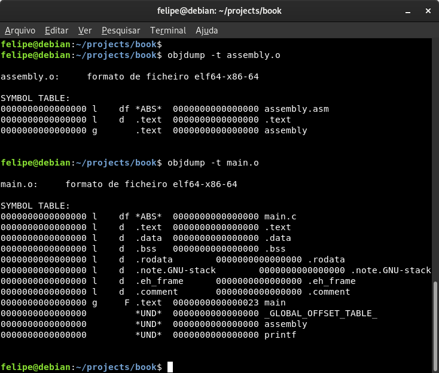

# Seções e símbolos

A esta altura você já deve ter reparado que nossa função `assembly` está em um arquivo separado da função `main`, mas de alguma maneira mágica a função pode ser executada e seu retorno capturado. Isso acontece graças a uma ferramenta chamada _linker_ que junta vários arquivos objetos em um arquivo executável de saída.

### Arquivo objeto

Um arquivo objeto é um formato de arquivo especial que permite organizar código e várias informações relacionadas a ele. Os arquivos **.o** \(ou **.obj**\) que geramos com a compilação da nossa PoC são arquivos objetos, eles organizam informações que serão usadas pelo _linker_ na hora de gerar o executável. Dentre essas informações, além do código em si, tem duas principais que são as seções e os símbolos.

### Seções

Uma seção no arquivo objeto nada mais é que uma maneira de agrupar dados no arquivo. É como criar um grupo novo e dar um sentido para ele. Três exemplos principais de seções são:

* A seção de código, onde o código que é executado pelo processador fica.
* Seção de dados, onde variáveis são alocadas.
* Seção de dados não inicializada, onde a memória será alocada dinamicamente ao carregar o executável na memória. Geralmente usada para variáveis não inicializadas, isto é, variáveis que não têm um valor inicial definido.

Na prática se pode definir quantas seções quiser \(dentro do limite suportado pelo formato de arquivo\) e para quais propósitos quiser também. Podemos até mesmo ter mais de uma seção de código, mais de uma seção de dados etc. O código em C é organizado pelo compilador, no nosso caso o GCC, e por isso nós não fizemos esse tipo de organização manualmente.

Existem quatro seções principais que podemos usar no nosso código e o _linker_ irá resolvê-las corretamente sem que nós precisamos dizer a ele como fazer seu trabalho. O NASM também reconhece essas seções como "padrão" e já configura os atributos delas corretamente.

* `.text` -- Usada para armazenar o código executável do nosso programa.
* `.data` -- Usada para armazenar dados inicializados do programa, por exemplo uma variável global.
* `.bss` -- Usada para reservar espaço para dados não-inicializados, por exemplo uma variável global que foi declarada mas não teve um valor inicial definido.
* `.rodata` ou `.rdata` -- Usada para armazenar dados que sejam somente leitura \(_readonly_\), por exemplo uma constante que não deve ter seu valor alterado em tempo de execução.


Esses nomes de seções são padronizados e códigos em C geralmente usam essas seções com esses mesmos nomes.


Seções tem _flags_ que definem atributos para a seção, as três _flags_ principais e que nos importa saber é:

* `read` -- Dá permissão de leitura para a seção.
* `write` -- Dá permissão de escrita para a seção, assim o código executado pode escrever dados nela.
* `exec` -- Dá permissão de executar os dados contidos na seção como código.

Na sintaxe do NASM é possível definir essas _flags_ manualmente em uma seção modificando seus atributos. Veja o exemplo abaixo:

```text
section .text exec

section .data write

section .outra write exec
```

Nos dois primeiros exemplos nada de fato foi alterado nas seções porque esses já são seus respectivos atributos padrão. Já a seção `.outra` não tem nenhuma permissão padrão definida por não ser nenhum dos nomes padronizados.

### Símbolos

Uma das informações salvas no arquivo objeto é a tabela de símbolos que é, como o nome sugere, uma tabela que define nomes e endereços para determinados símbolos usados no arquivo objeto. Um símbolo nada mais é que um nome para se referir a determinado endereço.

Parece familiar? Pois é, símbolos e rótulos são essencialmente a mesma coisa. A única diferença prática é que o rótulo apenas existe como conceito no arquivo fonte e o símbolo existe como um valor no arquivo objeto.

Quando definimos um rótulo em Assembly podemos "exportá-lo" como um símbolo para que outros arquivos objetos possam acessar aquele determinado endereço. Já vimos isso ser feito na nossa PoC, a diretiva `global` do NASM serve justamente para definir que aquele rótulo é global... Ou seja, que deve ser possível acessá-lo a partir de outros arquivos objetos.

### Linker

O _linker_ é o software encarregado de processar os arquivos objetos para que eles possam "conversar" entre si. Por exemplo, um símbolo definido no arquivo objeto **assembly.o** para que possa ser acessado no arquivo **main.o** o _linker_ precisa intermediar, porque os arquivos não vão trocar informação por mágica.

Na nossa PoC o arquivo objeto **main.o** avisa para o _linker_ que ele está acessando um símbolo externo \(que está em outro arquivo objeto\) chamado `assembly`. O _linker_ então se encarrega de procurar por esse símbolo, e ele acaba o achando no **assembly.o**. Ao achar o _linker_ calcula o endereço para aquele símbolo e seja lá aonde ele foi utilizado em **main.o** o _linker_ irá colocar o endereço correto.

Todas essas informações \(os locais onde foi utilizado, o endereço do símbolo, os símbolos externos acessados, os símbolos exportados etc.\) ficam na tabela de símbolos. Com a maravilhosa ferramenta **objdump** do GCC podemos ver a tal da tabela de símbolos nos nossos arquivos objetos. Basta rodar o comando:

```text
$ objdump -t arquivo_objeto.o
```

Se usarmos essa ferramenta nos nossos arquivos objetos podemos ver que, dentre vários símbolos lá encontrados, um deles é o `assembly`.



### O executável

Depois do _linker_ fazer o trabalho dele, ele gera o arquivo final que nós normalmente chamamos de executável. O executável de um sistema operacional nada mais é que um arquivo objeto que pode ser executado.

A diferença desse arquivo objeto final para o arquivo objeto anterior, é que esse está organizado de acordo com as "exigências" do sistema operacional e pronto para ser rodado. Enquanto o outro só tem informação referente àquele arquivo fonte, sem dar as informações necessárias para o sistema operacional poder rodá-lo como código. Até porque esse código ainda não está pronto para ser executado, ainda há símbolos e outras dependências para serem resolvidas pelo _linker_.

