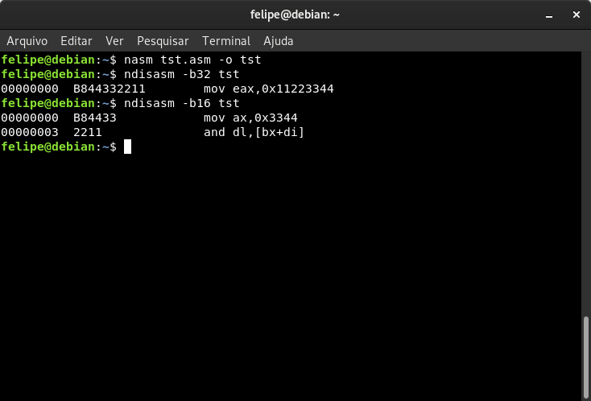
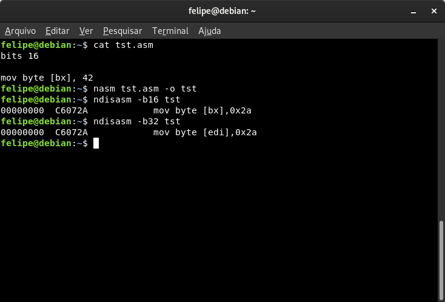

# Atributos

Você já deve ter reparado que as instruções têm mais informações do que nós explicitamos nelas. Por exemplo a instrução `mov eax, [0x100]` implicitamente acessa a memória a partir do segmento DS, além de que magicamente a instrução tem um tamanho específico de operando sem que a gente diga a ela.

Todas essas informações implícitas da instrução são especificadas a partir de atributos que tem determinados valores padrões que podem ser modificados. Os três atributos mais importantes para a gente entender é o _operand-size_, a_ddress-size_ e _segment_.


O opcode é um byte do código de máquina que especifica a operação a ser executada pelo processador. Em algumas instruções mais alguns bits de outro byte da instrução em código de máquina é utilizado para especificar operações diferentes, que é o campo REG do byte ModR/M. Como o já citado _far_ `call` por exemplo.


### Operand-size

Em _protected mode_ nós podemos acessar operandos de 32, 16 ou 8 bits. O que define o tamanho do operando na instrução é o atributo _operand-size_.

Instruções que lidam com operandos de 8 bits tem opcodes próprios só para eles. Mas as instruções que lidam com operandos de 16 e 32 são as mesmas instruções, mudando somente o atributo _operand-size_.

Vamos fazer um experimento com o código abaixo:


```text
bits 32

mov ah,  bh
mov eax, ebx
```


Compile esse código sem especificar qualquer formatação para o NASM, assim ele irá apenas colocar na saída as instruções que escrevemos:

```text
$ nasm tst.asm -o tst
```

Depois disso use o ndisasm especificando para desmontar instruções como de 32 bits, e depois, como de 16 bits. A saída ficará como no print abaixo:


Repare que tanto em 32 quanto 16 bits a instrução `mov ah, bh` não muda. Porém as instruções `mov eax, ebx` e `mov ax, bx` são **a mesma instrução**.

Só o que muda de um para outro é o _operand-size_. Enquanto em 32-bit por padrão o _operand-size_ é de 32 bits, em 16-bit ele é de 16-bit. Por isso que se dizemos para o disassembler que as instruções são de 16-bit ele desmonta a instrução como `mov ax, bx`. Porque é de fato essa operação que o processador em modo de 16-bit iria executar, não é um erro do disassembler.

E isso não vale só para registradores mas também para operandos imediatos e operandos em memória. Vamos fazer outro experimento:


```text
bits 32

mov eax, 0x11223344
```


Os comandos:

```text
$ nasm tst.asm -o tst
$ ndisasm -b32 tst
$ ndisasm -b16 tst
```

A saída fica assim:



Entendendo melhor a saída do ndisasm:

* A esquerda fica o _raw address_ da instrução em hexadecimal, que é um nome bonitinho para o índice do primeiro byte da instrução dentro do arquivo \(contando a partir de **0**\).
* No centro fica o código de máquina em hexadecimal. Os bytes são mostrados na mesma ordem em que estão no arquivo binário.
* Por fim a direita o disassembly das instruções.

Repare que quando dizemos para o ndisasm que as instruções são de 32-bit ele faz o disassembly correto e mostra `mov eax, 0x11223344`. Porém quando dizemos que é de 16-bit ele desmonta `mov ax, 0x3344` seguido de uma instrução que não tem nada a ver com o que a gente escreveu.

Se você prestar atenção no código de máquina vai notar que nosso operando imediato 0x11223344 está bem ali em _little-endian_ logo após o byte **B8** \(o opcode\). Porque é assim que operandos imediatos são dispostos no código de máquina, o valor imediato faz parte da instrução.

Agora no segundo caso quando dizemos que são instruções de 16-bit a instrução não espera um operando de 4 bytes mas sim 2 bytes. Por isso o disassembler considera isto aqui como a instrução:

```text
B8 44 33
```

Os bytes `22 11` ficam sobrando e acabam sendo desmontados como se fossem uma instrução diferente. Na prática o processador também executaria o código da mesma que o ndisasm o desmontou, um dos motivos do porque código de modos de processamento diferentes não são compatíveis entre si.


Em 64-bit o _operand-size_ também tem 32 bits por padrão.


### Address-size

O atributo de _address-size_ define o modo de endereçamento. O tamanho padrão do _offset_ acompanha a largura do barramento interno do processador \(ou o tamanho do _Instruction Pointer_\).

Quando o processador está em modo de 16-bit pode-se usar endereçamento de 16 ou 32 bits. O mesmo vale para modo de 32-bit onde se usa por padrão 32 bits de endereçamento mas dá para usar modo de endereçamento de 16 bits.

Já em 64-bit o _address-size_ é de 64 bits por padrão, mas também é possível usar endereçamento de 32 bits.


Apesar do _offset_ e RIP no submodo de 64-bit serem de 64 bits \(8 bytes\) de tamanho, na prática o barramento de endereço do processador tem apenas 48 bits \(6 bytes\) de tamanho.

Os dois bytes mais significativos de RIP não são usados e devem sempre estarem zerados. Endereços acima de 0x0000FFFFFFFFFFFF não são válidos em x86-64.


Mas o atributo não muda somente o tamanho do _offset_ mas todo ele devido ao fato de haver diferenças entre o modo de endereçamento de 16-bit e de 32-bit. Observe o disassembly no print:



A instrução `mov byte [bx], 42` compilada para 16-bit não altera apenas o tamanho do registrador, quando está em 32-bit, mas também o registrador em si. Isso acontece devido as diferenças de endereçamento já explicadas neste livro em [A base→Endereçamento](../a-base/enderecamento.md).

Agora observe a instrução `mov byte [ebx], 42` compilada para 32-bit:


Desta vez a diferença entre 32-bit e 64-bit foi unicamente relacionado ao tamanho. Mas agora um último experimento: `mov byte [r12], 42`. Desta vez com um registrador que não existe uma versão menor em 32-bit.


Existem duas diferenças: O registrador mudou para ESP e um byte **41** ficou sobrando antes da instrução.  
Dando um pouco de _spoiler_ do próximo tópico do livro, o byte que sobrou ali é o prefixo REX que não existe em 32-bit e por isso foi interpretado como outra instrução.

### Segment

Como explicado no tópico que fala sobre registradores de segmentos, algumas instruções fazem o endereçamento em determinados segmentos. O atributo de segmento padrão é definido de acordo com qual registrador é acessado pela instrução.

* RIP -- Segmento CS.
* RSP ou RBP -- Segmento SS.
* Qualquer outro registrador -- Segmento DS.

Exemplos:

```text
mov eax, [rbx]  ; Lê do endereço DS:RBX
mov eax, [rbp]  ; Lê do endereço SS:RBP
```

Determinadas instruções usam segmentos específicos, como no caso dos _far_ `call` ou `movsb`. Onde esse último acessa `DS:RSI` e `ES:RDI`.

