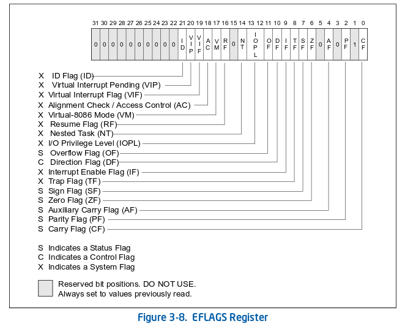

# Flags do processador

O registrador EFLAGS contém _flags_ que servem para indicar três tipos de informações diferentes:

* **Status** -- Indicam o resultado de uma operação aritmética.
* **Control** -- Controlam alguma característica de execução do processador.
* **System** -- Servem para configurar ou indicar alguma característica do _hardware_ relacionado a execução do código ou do sistema.

Enquanto o RFLAGS de 64 bits contém todas as mesmas _flags_ de EFLAGS sem nenhuma nova. Todos os 32 bits mais significativos do RFLAGS estão reservados e sem nenhum uso atualmente.  
Observe a figura abaixo retirada do [Intel Developer's Manual Vol. 1](https://software.intel.com/en-us/download/intel-64-and-ia-32-architectures-software-developers-manual-volume-1-basic-architecture), mostrando uma visão geral do bits de EFLAGS:



### Status Flags

Instruções que fazem operações aritméticas modificam estas _flags_ conforme o valor do resultado da operação. São instruções como `ADD`, `SUB`, `MUL` e `DIV` por exemplo.  
Porém um detalhe que é interessante saber é que existem duas instruções que normalmente são utilizadas para definir essas _flags_ para serem usadas junto com uma instrução condicional. Elas são: `CMP` e `TEST`.  
A instrução `cmp` nada mais é do que uma instrução que faz a mesma operação que `sub` porém sem modificar o valor dos operandos. Só que é uma operação aritmética de subtração da mesma forma.

Enquanto `test` faz uma operação _bitwise AND_ \(E bit a bit\) também sem modificar os operandos. Ou seja, o mesmo que a instrução `and`.  
Veja a tabela abaixo com todas as _status flags_:

| Bit | Nome | Sigla | Descrição |
| :--- | :--- | :--- | :--- |
| 0 | Carry Flag | CF | Setado se uma condição de _Carry_ ou _Borrow_ acontecer no bit mais significativo do resultado. Basicamente indica o _overflow_ de um valor não-sinalizado. |
| 2 | Parity Flag | PF | ​Setado se o byte menos significativo do resultado conter um número par de bits 1. |
| 4 | Auxiliary Carry Flag | AF | Setado se uma condição de _Carry_ ou _Borrow_ acontecer no bit 3 do resultado. |
| 6 | Zero Flag | ZF | Setado se o resultado for zero. |
| 7 | Sign Flag | SF | Setado para o mesmo valor do bit mais significativo do resultado. Onde 0 indica um valor positivo e 1 indica um valor negativo. |
| 11 | Overflow Flag | OF | Setado se o resultado não tiver o sinal esperado da operação aritmética. Basicamente indica o _overflow_ de um número sinalizado. |


_Carry_, ou carrinho/transporte, é o que a gente conhece no Brasil como "vai um"  em uma operação aritmética de soma.  
_Borrow_ é o mesmo princípio porém em aritmética de subtração, em linguagem coloquial chamado de "pegar emprestado".


Dentre essas _flags_ somente CF pode ser modificada diretamente, e isto é feito com as seguintes instruções:

```text
stc  ; (Set CF)        Seta o valor da Carry Flag
clc  ; (Clear CF)      Zera o valor da Carry Flag
cmc  ; (coMplement CF) Inverte o valor da Carry Flag
```

### Control Flags

| Bit | Nome | Sigla | Descrição |
| :--- | :--- | :--- | :--- |
| 10 | Direction Flag | DF | Controla a direção para onde as instruções de _string_ \(`MOVS`, `SCAS`, `STOS`, `CMPS` e `LODS`\) irão decorrer a memória. |

Se DF estiver setada, as instruções de _string_ irão decrementar o valor do\(s\) registrador\(es\). Se estiver zerada ela irá incrementar, que é o valor padrão para esta _flag_.

```text
std  ; (Set DF)    Seta o valor da Direction Flag
cld  ; (Clear DF)  Zera o valor da Direction Flag
```


Caso sete o valor desta _flag_ é importante que a zere novamente em seguida. Código compilado normalmente espera que por padrão esta _flag_ esteja zerada.  
Comportamentos imprevistos podem acontecer caso você não a zere depois de usar.


### System Flags

Estas _flags_ podem ser lidas por qualquer programa porém somente o sistema operacional pode modificar seus valores. \(exceto ID\)  
Abaixo irei falar somente das _flags_ que nos interessam saber por agora.

| Bit | Nome | Sigla | Descrição |
| :--- | :--- | :--- | :--- |
| 8 | Trap Flag | TF | Se setada o processador irá executar as instruções do programa passo a passo. Neste modo o processador dispara uma _exception_ para cada instrução executada. É normalmente usada para depuração de código. |
| 9 | Interrupt enable Flag | IF | Controla a resposta do processador para interrupções que podem ser ignoradas. \(interrupções mascaráveis\) |
| 12-13 | I/O Privilege Level field | IOPL | Indica o nível de acesso para a comunicação direta com o _hardware_ \(operações de I/O\) do programa atual. |
| 14 | Nested Task flag | NT | Se setada indica que a tarefa atual está vinculada com uma tarefa anterior. Esta _flag_ controla o comportamento da instrução `IRET`. |
| 16 | Resume Flag | RF | Se setada as _exceptions_ disparadas pelo processador são temporariamente desabilitadas na instrução seguinte. Geralmente usada por depuradores. |
| 17 | Virtual-8086 Mode flag | VM | Em _protected mode_, se esta _flag_ for setada o processador entra em modo Virtual-8086. |
| 21 | Identification flag | ID | Se um processo conseguir setar ou zerar esta _flag_, isto indica que o processador suporta a instrução `CPUID`. |


IOPL na verdade não é uma _flag_ mas sim um campo de 2 bits que indica o nível de privilégio de acesso para operações de I/O a partir da porta física do processador.


As instruções abaixo podem ser utilizadas para modificar o valor de IF:

```text
sti  ; (Set IF)   Seta o valor da Interrupt Flag
cli  ; (Clear IF) Zera o valor da Interrupt Flag
```

### FLAGS \(16-bit\)

Em _real mode_ dentre as _system flags_ somente TF e IF existem. E elas são consideradas _control flags_ junto com DF, ou seja, não dependem de qualquer tipo de privilégio para serem modificadas.

