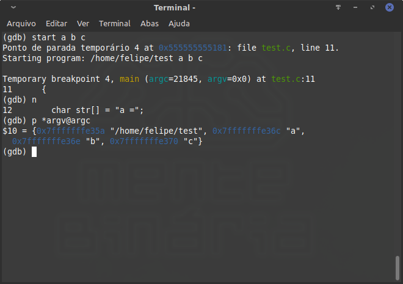

# Interrupções de software e exceções

Uma interrupção é um sinal enviado para o processador solicitando a atenção dele para a execução de outro código. Então ele para o que está executando agora, executa este determinado código da interrupção e depois volta a executar o código que estava executando antes.  
Este sinal é geralmente enviado por um hardware externo para a CPU, cujo o mesmo é chamado de IRQ — _Interrupt Request_ — que significa "pedido de interrupção".

Enquanto a interrupção de software é executada de maneira muito semelhante a uma chamada de procedimento por _far_ `call`. Ela é basicamente uma interrupção que é executada pelo software rodando na CPU, daí o nome.

### Interrupt Descriptor Table

O código que é executado quando uma interrupção é disparada se chama _handler_, e o endereço do mesmo é definido na **IDT** — _Interrupt Descriptor Table_ —.  
Esta tabela nada mais é que uma sequência de valores indicando o _offset_ e segmento do código à ser executado. É basicamente uma _array_ onde cada elemento contém estas duas informações. Poderíamos representar em C da seguinte forma:

```c
// Em 16-bit

struct elem {
  uint16_t offset;
  uint16_t segment;
}

struct elem idt[256];
```

Ou seja, o número que identifica a interrupção nada mais é que o índice a ser lido no vetor.

### Exception

Provavelmente você já ouviu falar em _exception_.  A _exception_ é tratada pelo processador da mesma forma que uma interrupção, inclusive o _handler_ delas fica na mesma tabela. Por exemplo quando você comete um erro clássico de tentar acessar uma região de memória inválida ou sem permissões adequadas em C, você compila o código e recebe a clássica mensagem _segmentation fault_.

Neste caso a exceção que foi disparada pelo processador se chama _General Protection_ e pode ser referida pelo mnemônico \#GP, seu índice na tabela é 13.


Essa exceção é disparada quando há um problema na referência de memória ou qualquer proteção à memória que foi violada. Como por exemplo ao tentar escrever em uma seção de memória que não se tem permissão para isso.

Um sistema operacional configura uma exceção da mesma forma que configura uma interrupção, modificando a IDT para apontar para o código que ele quer que execute. Neste caso o índice 13 precisaria ser modificado.


No Linux basicamente o que o sistema faz é criar um _handler_ que trata a exceção e manda um sinal para o processo. Este sinal o processo pode configurar como ele quer tratar, mas por padrão o processo escreve uma mensagem no terminal e finaliza.


### IDT em _Real Mode_


A instrução `int` é usada para disparar interrupções de software ou exceções. Bastando simplesmente passar o índice da interrupção como operando.


Vamos ver na prática a configuração de uma interrupção em 16-bit. Para isso vamos usar o MS-DOS para que fique mais simples.

A IDT está localizada no endereço 0, por isso podemos configurar para acessar o segmento zero e assim o _offset_ seria o índice de cada elemento da IDT. O que precisamos fazer é acessar o índice que queremos modificar na IDT, depois é só jogar o _offset_ e segmento do procedimento que queremos que seja executado. Em 16-bit isso acontece de uma maneira muito mais simples do que em _protected mode_, por isso é ideal para entender na prática.

Eis o código:


```c
bits 16
org  0x100

VADDR equ 0xb800

; ID, segmento, offset
%macro setint 3
  mov bx, (%1) * 4
  mov word [es:bx], %3
  add bx, 2
  mov word [es:bx], %2
%endmacro


; -- Main -- ;
mov ax, 0
mov es, ax

setint 0x66, cs, int_putchar

mov al, 'A'
mov ah, 0x0B
int 0x66

mov ah, 0x0C
int 0x66

ret

; -- Interrupção -- ;
int_cursor: dw 0

; Argumentos:
;   AL    Caractere
;   AH    Atributo
int_putchar:
  push es
  mov bx, VADDR
  mov es, bx

  mov di, [int_cursor]
  mov word [es:di], ax

  add word [int_cursor], 2
  pop es
  iret
```


Para montar e testar usando o Dosbox:

```bash
$ nasm int.asm -o int.com
$ dosbox int.com
```



A interrupção simplesmente escreve os caracteres na parte superior esquerda da tela.

Note que a interrupção retorna usando a instrução `iret` ao invés de `ret`. Em 16-bit a única diferença nesta instrução é que ela também desempilha o registrador de _flags_, que é empilhado pelo processador ao disparar a interrupção/exceção.


Perceba que é unicamente um código de exemplo. Esta não é uma maneira segura de se configurar uma interrupção tendo em vista que seu _handler_ está na memória do .com que, após finalizar sua execução, a memória será sobrescrita por outro programa executado posteriormente.


Vamos dessa vez configurar uma exceção. A exceção que vamos configurar é a \#BP de índice 3.  
Se você já usou um depurador, ou pelo menos tem uma noção à respeito, sabe que "_breakpoint_" é um ponto no código onde o depurador faz uma parada e te permite analisar o programa enquanto ele fica em pausa.


Os depuradores modificam a instrução original colocando a instrução que dispara a exceção de _breakpoint_, depois tratam o sinal enviado para o processo, restauram a instrução original e continuam seu trabalho.


O _breakpoint_ nada mais é que uma exceção que é disparada por uma instrução. Podemos usar `int 0x03`para fazer isso, porém esta instrução tem 2 bytes de tamanho e não é muito apropriada para um depurador usar. Por isto existe a instrução `int3` que dispara \#BP explicitamente e tem somente 1 byte de tamanho. \(_opcode_ 0xCC\)


```c
bits 16
org  0x100

; ID, segmento, offset
%macro setint 3
  mov bx, (%1) * 4
  mov word [es:bx], %3
  add bx, 2
  mov word [es:bx], %2
%endmacro


; -- Main -- ;

xor ax, ax
mov es, ax

setint 0x03, cs, break

int3
int3

ret

; -- Breakpoint -- ;

break:
  mov ah, 0x0E
  mov al, 'X'
  int 0x10
  iret
```



Repare que cada execução de `int3`executou o código do nosso procedimento **break**. Este por sua vez imprimiu o caractere 'X' na tela do nosso MS-DOS usando a interrupção 0x10 que será explicada no próximo capítulo.

### Sinais

Só para deixar mais claro o que falei sobre os sinais que são enviados para o processo quando uma _exception_ é disparada, aqui um código em C de exemplo:

```c
#include <stdio.h>
#include <stdlib.h>
#include <string.h>
#include <signal.h>

void segfault(int signum)
{
  fputs("Tá pegando fogo bixo!\n", stderr);
  exit(signum);
}

// Esse código também funciona no Windows.
int main(void)
{
  char *desastre = NULL;
  signal(SIGSEGV, segfault);

  strcpy(desastre, "Eita!");

  puts("Tchau mundo!");
  return 0;
}

```


