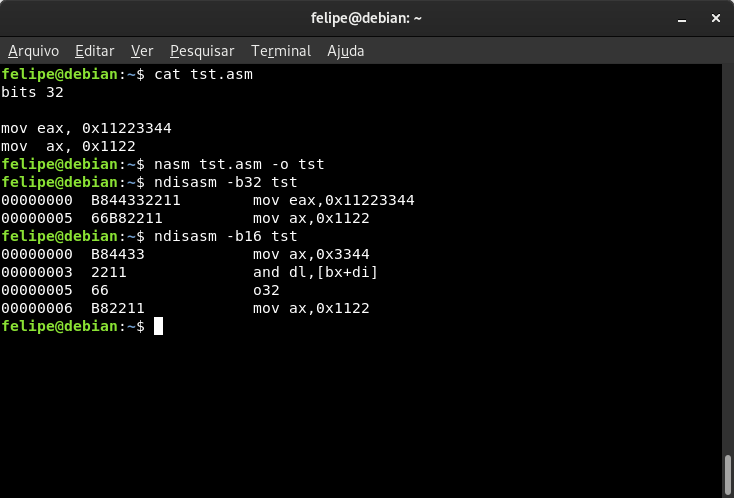

# Prefixos

O código de máquina pode receber alguns bytes que antecedem o opcode que são chamados de prefixos. Eles basicamente servem para modificar atributos da operação que será executada pelo processador. Abaixo vou falar de alguns prefixos e explicar o que eles fazem.

### Operand-size override

Esse prefixo, cujo o byte é **0x66**, serve para sobrescrever o atributo de _operand-size_. Ele basicamente alterna o atributo para o seu valor não-padrão. Se o _operand-size_ padrão é de 32 bits ao usar esse prefixo ele alterna para 16 bits, e vice-versa. Observe abaixo:



No primeiro disassembly se a gente prestar atenção no código de máquina irá notar que a única diferença entre as duas instruções, além do tamanho do operando imediato, é a presença do byte **0x66** logo antes do opcode **0xB8**.

O NASM se encarrega de usar os prefixos adequados quando se mostram necessários. Porém podemos usar as diretivas `o16`, `o32` e `o64` antes da instrução no NASM para "forçar" o tamanho do _operand-size_ para 16, 32 ou 64 bits respectivamente. Desta forma o NASM usaria os prefixos corretos se fossem necessários.

É importante entender o que a instrução faz e o que cada atributo representa nela para poder fazer o uso correto destas diretivas.


Se você quiser forçar o uso de um prefixo em uma determinada instrução basta fazer o _dump_ do byte logo antes da mesma. Exemplo:  
`db 0x66  
mov eax, ebx`

Obs.: Isso é **gambiarra**. Só mostrei como curiosidade.


### Address-size override

Esse prefixo de byte **0x67** segue a mesma lógica do anterior, só que desta vez alternando o tamanho do atributo de _address-size_. O NASM tem as diretivas `a16`, `a32` e `a64` para explicitar um _address-size_ para a instrução.

Um exemplo interessante de uso é com a instrução `LOOP/LOOPcc`. Acontece que o que determina se essa instrução irá usar RCX, ECX ou CX é o _address-size_. Vamos supor o código de 16-bit:

```text
bits 16

mov ecx, 99999
.lp:
  ; Faça alguma coisa
a32 loop .lp
```

Ao adicionar o prefixo **0x67** à instrução `loop` eu sobrescrevo o _address-size_ para 32 bits e faço a instrução usar o registrador ECX ao invés de CX. Me permitindo assim efetuar _loops_ mais longos do que supostamente sou limitado.

E se por acaso eu compilar essa instrução para 32-bit, então o prefixo não será adicionado pelo NASM e ECX ainda será usado de qualquer forma.


Cuidado ao usar `a64` ou `o64`. Essa diretivas demandam o uso do prefixo REX que só existe em submodo de 64-bit.


### Segment override

Esse não é um mas sim 6 prefixos diferentes usados para fazer a sobrescrita do segmento para CS, SS, DS, ES, FS ou GS.

No tópico de [registradores de segmento](registradores-de-segmento.md) nós já vimos uma forma de usar o prefixo de sobrescrita de segmento, porém também é possível usá-lo simplesmente adicionando o nome do registrador de segmento antes da instrução. Veja que as duas instruções abaixo são equivalentes:

```text
bits 32

mov byte [es:ebx], 32
es mov byte [ebx], 32
```

Por que você não tenta usar cada um desses prefixos para ver qual byte eles adicionam no código de máquina?

### REX

Você já deve ter notado que dá para brincar entre 32 e 16 bits, mas e os 64 bits? Bom, acontece que para tornar o x86-64 possível foram feitas algumas ~~gambiarras~~ adaptações no _machine code_ da arquitetura.

Veja este código:

```text
bits 32

inc ecx
db 0xFF, 0xC1
```

Agora veja o que o disasembler nos diz sobre isso aí:


Pois é, os bytes que eu fiz o _dump_ manualmente resultam na mesma operação. Só que o NASM sempre usa a primeira versão porque é menor, só tem 1 byte de tamanho em contraste com os 2 bytes da outra.

Essas duas instruções equivalentes basicamente são:

```text
inc reg
inc r/m
```

Se eu escrevesse `inc dword [ebx]` aí sim o NASM usaria a segunda instrução porém para incrementar um operando em memória.

Em 64-bit as instruções `inc reg` e `dec reg` simplesmente não existem. Elas foram assassinadas para dar lugar para um novo prefixo, o REX \(`inc r/m` e `dec r/m` são usadas em seu lugar\).

O REX tem um campo de 4 bits que serve para trabalhar com operações em versão de 64 bits. Todas as alternâncias em relação a 32/64 bits é feita em um dos bits do prefixo REX, onde cada bit tem uma função diferente.

Basicamente o REX, incluindo todas as variações de combinações de cada bit, são todos os bytes entre **0x40** e **0x4F** \(só em 64-bit, é claro\). Vejamos o exemplo:


Veja que para fazer o incremento de RCX o prefixo REX **0x48** foi utilizado. Em 32-bit esse byte foi interpretado como `dec eax`.

### REP/REPE/REPNE

Instruções relacionadas a operações com blocos de dados, as famosas _strings_, podem ser acompanhadas por um prefixo para fazer com que a instrução seja repetida várias vezes.

O uso desse prefixo é basicamente seguindo a mesma lógica das instruções `LOOP/LOOPE/LOOPNE` que usa uma parte do mapeamento de RCX como contador e é possível usar uma condição extra para só repetir se a comparação der igual ou não igual.

Também é possível sobrescrever _address-size_ para mudar o registrador usado como contador. Observe um exemplo de reimplementação de `strlen()` usando esse prefixo e a instrução `scasb`, tente entender o código:



```text
bits 64

section .text

global my_strlen
my_strlen:
  mov ecx, -1
  xor eax, eax
  
  repne scasb

  mov eax, -2
  sub eax, ecx
  ret
```



```c

#include <stdio.h>

int my_strlen(char *);

int main(void)
{
  printf("Resultado: %d\n", my_strlen("Hello World!"));
  return 0;
}
```




REP e REPE são nomes diferentes para o mesmo prefixo. Sua lógica muda dependendo de em qual instrução foi utilizada, se em uma que faz comparação ou não.


